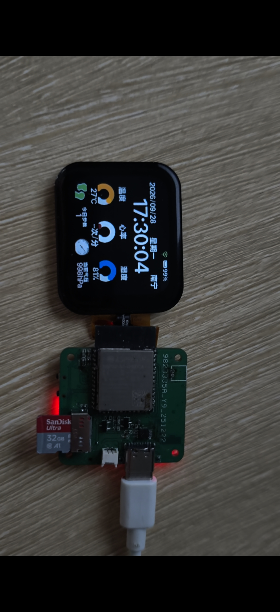
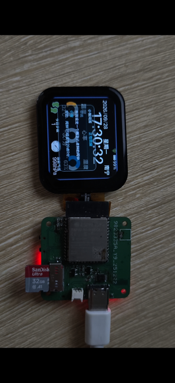
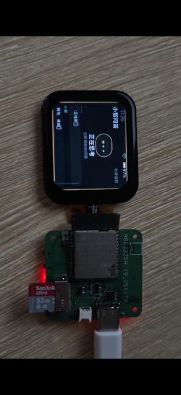
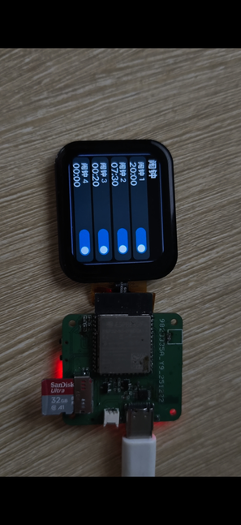

# ESP32-S3 智能手表

基于 ESP-IDF、FreeRTOS 与 LVGL 的 1.83 英寸触屏手表固件，提供表盘、传感器、Wi-Fi 天气、本地音乐、闹钟、计时、语音助手和无线固件更新。当前版本将 240 × 284 物理屏幕旋转为 **284 × 240 横屏**。下图为开发板与屏幕组合的实物照片。

| 设备与界面 | 语音助手 | 闹钟 |
| --- | --- | --- |
|  |  |  |

## 已实现功能

| 模块 | 功能 |
| --- | --- |
| 表盘与交互 | 时间、日期、天气、步数、心率、气压、电量和 Wi-Fi 状态展示；触摸应用列表；横屏坐标适配；快捷设置中的亮度、音量和 Wi-Fi 入口。电量百分比由电压估算。 |
| 语音助手 | ESP-SR WakeNet9 在设备本地识别“你好小智”；唤醒后最多等待约 15 秒开始说话；百度 ASR 识别、星火大模型回复、百度 TTS 播报。语音浮窗显示识别与回复，点击窗外或退出 AI 页面可取消当前录音、识别和播报，随后等待下一次唤醒。 |
| 语音控制 | 本地规则处理报时、天气、步数、亮度、音量、闹钟和页面切换；未命中的问答交给大模型。大模型回复中的设备指令可设置亮度、音量和闹钟，或切换页面。最低亮度保留 5%，避免屏幕全黑。 |
| 音乐 | 从 SD 卡读取 Ogg Vorbis、FLAC 文件；歌曲列表、播放/暂停、进度与音量控制。暂停后记录播放位置，继续时从该位置恢复；音乐播放与语音唤醒协调麦克风、音频输出及内存资源。 |
| 时间工具 | BM8563 RTC 开机恢复时间；联网时 SNTP 校时并写回 RTC；断网时可在“日历 → 校时”手动设置。提供 4 组闹钟、倒计时和秒表；倒计时结束后亮屏提醒。 |
| 网络与维护 | 手表界面扫描并连接 Wi-Fi；联网天气；手机与手表在同一 Wi-Fi 时，通过设备上的 OTA 页面上传应用固件。支持通过 USB 串口向已挂载的 SD 卡导入 Ogg 音乐。 |
| 待机与传感器 | MPU6050 计步、BMP280 气压/温度、EM7028 心率数据接入；息屏时降低部分传感器和界面刷新频率，同时保留语音唤醒。 |

在线语音、天气和 OTA 需要可用网络；语音与天气还需自行配置服务凭据。部分硬件体验与测量准确度见“已知限制”。

## 硬件与环境

- ESP32-S3，16 MB Flash，八线 PSRAM。
- 物理屏幕为 240 × 284 的 ST7789V 显示屏和触摸屏；屏幕规格见仓库中的 `P183B001-V4-CTP.pdf`。
- 音频相关功能使用 PDM 麦克风、MAX98357A 功放和 SD 卡；时间与传感器使用 BM8563、MPU6050、BMP280 和 EM7028。实际引脚以 `components/display/include/board_display_config.h`、`main/ai_chat/ai_chat_config.h` 与 `main/sd_spi_config.h` 为准。
- 推荐 ESP-IDF **5.5.1**。`main/idf_component.yml` 固定 LVGL 9.4.0、`esp_lvgl_port` 2.7.0 和 ESP-SR 2.4.7；`dependencies.lock` 记录依赖版本。首次构建需要下载唤醒模型。

## 显示与触摸方向

- 当前固件将物理屏幕旋转 90°，画面按 **284 × 240 横屏**显示。实体屏幕、PCB 和 3D 打印外壳的摆放方向没有更换。
- 触摸坐标同步交换 X/Y 并镜像两个方向，使触摸位置与横屏控件对应。
- 原有竖屏页面在加载时转换为横屏布局；AI 动画、弹窗和快捷设置等后续更新的控件也使用横屏坐标。
- 页面首次显示前同步最近的电量和 Wi-Fi 状态；电池图标与百分比原位刷新，首页和天气页的 Wi-Fi 图标位置已重新校准。

## 快速开始

1. 安装并激活 ESP-IDF 5.5.1，克隆本仓库，然后进入项目根目录。
2. 运行 `idf.py set-target esp32s3`，再运行 `idf.py build`。`sdkconfig.defaults` 已包含 16 MB Flash、自定义分区表、八线 PSRAM、中文 SD 文件名及界面字体设置；首次构建后仍应按实物检查 `sdkconfig`。
3. 用 `idf.py -p <串口号> flash monitor` 烧录并查看日志。首次应使用完整的 `flash`，以写入应用、资源分区和 ESP-SR 唤醒模型；只更新已具备这些分区的设备时，才可使用 `app-flash`。应用固件为 `build/esp32_s3_watch.bin`。

Windows 下也可在 ESP-IDF 命令行运行 `quick_build.cmd`（编译、烧录、监视）或 `build_and_flash.cmd`（先清理再编译、烧录、监视）。这两个脚本会操作当前连接的设备，使用前先确认串口。

## 配置网络与服务

1. 复制 `main/ai_chat/ai_chat_config_user.h.example` 为同目录的 `ai_chat_config_user.h`，填写自己的 Wi-Fi、大模型和百度语音参数。
2. 复制 `main/weather_config_user.h.example` 为同目录的 `weather_config_user.h`，填写自己的天气和高德地图密钥。
3. 两个 `_user.h` 文件只保存在本机，已加入 `.gitignore`。不配置服务密钥也能编译，但相应联网功能不可用。Wi-Fi 也可以通过设备界面配置。

## 时间与离线使用

- 开机时优先从 BM8563 RTC 恢复时间；联网成功后使用 SNTP 校时，并将新时间写回 RTC。
- 没有网络时，打开手表的“日历 → 校时”，调好年月日时分，点“保存到 RTC”。显示“已保存到 RTC”表示写入成功；显示“仅本次有效”表示系统时间已设置，但 RTC 未成功保存，重启后可能丢失。
- 应用列表的“计时”提供倒计时和秒表；倒计时结束时会亮屏显示提醒。

本地音乐读取 SD 卡根目录，当前最多显示前 32 首，支持真正的 Ogg Vorbis 和 FLAC；仅改文件扩展名无法播放。电脑若无法稳定读取 SD 卡，可在手表成功挂载 SD 卡后通过 USB 串口导入 Ogg 文件：安装 Python 的 `pyserial`，执行 `python tools/send_music_serial.py COM7 歌曲1.ogg 歌曲2.ogg`（按实际端口和文件路径替换）。同名文件不会被覆盖；传输中断留下的 `.part` 文件需从 SD 卡中手动删除后重试。无线更新页面要求手机与手表在同一 Wi-Fi 下，上传本工程构建的 `.bin` 文件。

## 语音助手与设备控制

- 说“你好小智”后，在约 15 秒内开始说话。语音浮窗显示识别和回复；点击浮窗外立即取消本轮录音、识别与播报，下一次说唤醒词会重新显示完整问答框。离开 AI 页面也会结束当前语音会话。
- 可询问天气、步数和当前时间，或说出亮度、音量、闹钟及页面切换指令。本地规则优先处理常见指令，其他问答使用星火大模型。大模型返回的设备控制标签会在显示和播报前解析执行。
- 播放音乐时语音监听会释放唤醒模型和麦克风；暂停音乐后重新等待唤醒。音乐暂停进度会保存，继续播放从该位置恢复。

## 目录说明

| 路径 | 内容 |
| --- | --- |
| `main/` | 应用入口、音频、传感器、网络与功能模块 |
| `main/voice_dialog.cpp`、`main/local_wake_word.cpp`、`main/voice_local_intent.c` | 本地唤醒、语音会话与设备控制意图 |
| `main/ai_command.c` | 大模型设备指令解析与执行 |
| `main/music_player.c`、`main/audio_decoder/` | SD 音乐播放与解码 |
| `main/time_tools.c`、`main/clock_setting.c`、`main/alarm_clock.c` | 计时、RTC 校时与闹钟 |
| `main/ui/` | 手表页面与主题；`generated/` 是原有生成界面 |
| `components/` | 显示和 Wi-Fi 组件 |
| `html/`、`img/` | 构建时写入 SPIFFS 分区的资源 |
| `partitions_webserver.csv` | 固件、OTA、资源与唤醒模型分区 |

## 已知限制

- 当前中文字体是子集，新歌曲名或在线回复可能出现缺字。
- 状态栏的电池图标与百分比由电压估算；电压尚未用万用表校准，充电时读数也不能视作准确的剩余电量。
- 心率、步数等传感器显示不是医疗测量结果。
- 在线语音和天气需要自行申请服务凭据与可用网络。
- BM8563 断电后的保时能力尚未在实物上单独验证。
- 倒计时结束目前为屏幕提醒，没有提示音。息屏时仍保持麦克风和计步运行，因此不是整机深度睡眠；续航增益尚未量化。
- Wi-Fi 密码键盘右上角退格键已加宽，但 P 与 O 邻近位置仍有实屏误触反馈。
